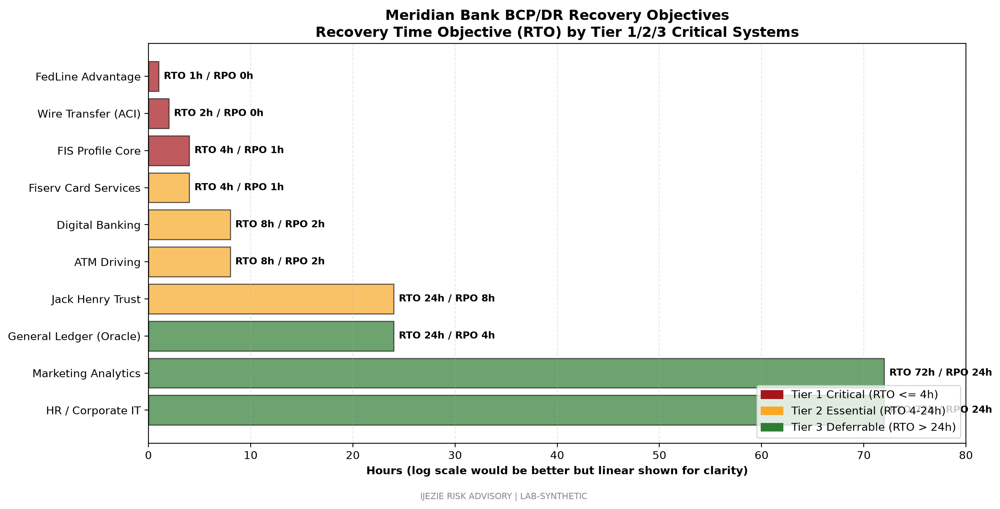

# BCP and DR Readiness Package

## 1. Scope and Methodology

This package documents Meridian Bank's business continuity and disaster recovery (BCP/DR) readiness posture for examiner review. The scope covers four operational perimeters: FIS Profile core banking, wire transfer and correspondent banking (ACI/FedLine), wealth management and trust operations (Jack Henry SilverLake), and digital banking channels (web, mobile, Zelle, ATM). The methodology follows the FFIEC IT Examination Handbook Business Continuity Management Booklet and aligns to NIST CSF 2.0 recover and protect functions.

The Business Impact Analysis (BIA) was refreshed in March 2026 with executive interviews across Operations, Treasury, BSA, IT, and Trust. Recovery Time Objectives (RTO) and Recovery Point Objectives (RPO) are tiered by criticality to customer impact, regulatory obligation, and revenue exposure. Tier 1 systems are loss-of-life or regulator-mandated; Tier 2 systems are customer-impacting within 24 hours; Tier 3 systems are deferrable for 72 hours or more.

Validation is performed annually through a full enterprise DR exercise plus quarterly component tests. Results are reported to the Board Risk Committee each quarter and to the OCC during the annual IT examination cycle.

## 2. BIA Results by Tier

| System / Perimeter | Tier | RTO | RPO | Owner |
|---|---|---|---|---|
| FIS Profile core banking | Tier 1 Critical | 4 hours | 15 minutes | CIO |
| Wire transfer (ACI) | Tier 1 Critical | 2 hours | 0 (in-flight wires) | BSA Officer |
| FedLine Advantage access | Tier 1 Critical | 1 hour | 0 (settlement) | Head of Operations |
| Jack Henry SilverLake trust | Tier 2 Essential | 24 hours | 4 hours | Head of Wealth |
| Fiserv card services auth | Tier 2 Essential | 4 hours | 15 minutes | CIO |
| Digital banking channels | Tier 2 Essential | 8 hours | 1 hour | CIO |
| ATM driving platform | Tier 2 Essential | 8 hours | 4 hours | Head of Branch Ops |
| Marketing analytics | Tier 3 Deferrable | 72 hours | 24 hours | CMO |
| Internal HR and corporate IT | Tier 3 Deferrable | 72 hours | 24 hours | CIO |
| Wealth management reporting | Tier 3 Deferrable | 72 hours | 24 hours | Head of Wealth |
| Branch video archival | Tier 3 Deferrable | 168 hours | 24 hours | Head of Physical Security |

## 3. RTO and RPO Requirements by System

Tier 1 systems map directly to regulatory or settlement obligations. FedLine Advantage carries the tightest target because the Federal Reserve imposes continuous-availability expectations under Operating Circular 5 and the FFIEC Wholesale Payments Booklet. Wire transfer RPO is zero for in-flight wires because a duplicated wire cannot be reversed through normal channels. FIS Profile RTO is 4 hours based on FFIEC guidance for core banking and on Meridian's customer commitments to retail and commercial depositors.

Tier 2 systems reflect customer-facing impact within a banking day. Digital banking channels (RTO 8 hours) include web, mobile, Zelle, and bill pay. Fiserv card authorization (RTO 4 hours) is bound by the card network operating rules and Meridian's merchant commitments. Trust operations (RTO 24 hours) reflect fiduciary workflows that can be re-entered without settlement loss.

Tier 3 systems have no regulatory or settlement exposure and are recovered only after Tier 1 and Tier 2 restoration is confirmed stable.

## 4. Recovery Procedures

### 4.1 FIS Profile Failover

The FIS Profile production environment runs from FIS data centers in Dallas, Texas and Birmingham, Alabama under an active-active model for Meridian's tenant. Failover is initiated by FIS under the master service agreement with Meridian CIO notification. Meridian's operational responsibility is branch and end-user device recovery at the Ashburn, Virginia DR site (warm site) and Charlotte headquarters (primary).

Step 1: FIS declares a regional incident and Meridian CIO receives notification within 15 minutes.
Step 2: FIS executes platform-level failover; Meridian branch back-office reroutes through Charlotte production VPN concentrators with site-to-site failover to Ashburn.
Step 3: Teller workstations reconnect to alternate FIS endpoint within RTO window.
Step 4: Operations confirms customer-facing transactions (deposits, withdrawals, transfers) before stand-down.

### 4.2 Wire Transfer Recovery

Wire transfer recovery is operated jointly between Meridian Treasury, BSA, and ACI Worldwide. ACI's Posttrade platform supports queue replay from the last successful journal checkpoint. For wires cleared through FedLine Advantage, the Federal Reserve session is re-established from the Ashburn DR node using pre-positioned security tokens and dual-control physical credentials.

Step 1: Treasury Operations notifies the BSA Officer and CISO within 30 minutes of any disruption.
Step 2: ACI replays queued wires from journal; OFAC screening runs against the latest SDN list before release.
Step 3: FedLine Advantage session re-established at Ashburn DR with second-person verification.
Step 4: BSA Officer signs off on resumed wire origination; Communications issues status update to commercial customers within the first hour.

### 4.3 FedLine Advantage Recovery

FedLine Advantage is the primary federal settlement channel. Recovery procedures are aligned to the Federal Reserve's Operating Circular 5 and tested during the quarterly DR cycle. Token re-issuance and operator credentialing are pre-staged at the Ashburn DR site under dual custody.

Step 1: Treasury Operations initiates FedLine failover script.
Step 2: Second authorized operator validates token and establishes session at Ashburn.
Step 3: Federal Reserve Bank is notified of session continuity per Operating Circular 5.
Step 4: Wire origination resumes with elevated monitoring through end of day.

## 5. DR Test Schedule and Results

The DR test calendar combines annual full-enterprise exercises with quarterly component tests:

- Q1: FIS Profile failover component test (March 2026, passed, RTO 3h 47m achieved)
- Q2: Wire transfer and FedLine joint test with Federal Reserve notification (June 2026, scheduled)
- Q3: Annual full-enterprise exercise including Ashburn warm-site activation (September 2026)
- Q4: Digital channels and Zelle failover (December 2026)

The March 2026 FIS Profile test exercised core banking failover from Dallas to Birmingham with concurrent branch rerouting at the Ashburn DR site. Results: RTO achieved at 3h 47m against the 4-hour target. Two findings were identified: (a) branch back-office VPN concentrator redundancy required additional capacity, and (b) test communications tree had two stale contact records. Both are remediated in the Q2 cycle.

## 6. Regional Event Scenarios

Scenario A: Hurricane impact on the Charlotte region. Trigger conditions: state of emergency declared for Mecklenburg County, mandatory evacuation of headquarters, or loss of primary data center connectivity for more than 30 minutes. Activation: Head of Business Continuity declares enterprise BCP activation within 2 hours of trigger; CEO authorizes remote operations and alternate site relocation. Treasury moves wire operations to Ashburn DR; FIS Profile continues from FIS-hosted environment without Meridian-side failover.

Scenario B: Ransomware on a managed service provider. Trigger conditions: confirmed ransomware at FIS, Fiserv, ACI, or Jack Henry with potential customer NPI exposure. Activation: CISO leads incident response; Vendor Management Officer coordinates vendor SLA enforcement; General Counsel leads notification decisions. The CISO Assistant incident response playbook governs the first 24 hours.

Scenario C: Regional power outage affecting multiple branches. Trigger conditions: more than 10 branches without power or network for more than 4 hours. Activation: Operations redirects customer transactions to ATM fleet and digital channels; branches communicate status to corporate hotline; service recovery tracked in the IT service management tool.

## 7. Communication Plan

The communication plan covers internal stakeholders (Board, executive team, employees), customers, regulators, and the public. Primary channels: employee emergency hotline, customer status page, executive group text, OCC supervisory contact, and pre-drafted media templates. Communications cadence: hourly status updates during the first 8 hours, then every 4 hours through stand-down. The CISO and COO jointly approve all external messaging.

## 8. Vendor Coordination

Vendor coordination for BCP/DR is documented in each critical vendor's runbook. FIS, ACI, Fiserv, and Jack Henry all maintain their own DR programs aligned to FFIEC guidance; Meridian reviews vendor DR reports annually and requests participation in joint exercises for in-scope systems. The Head of Third-Party Risk Management tracks vendor BCP attestation status in the central TPRM register.

## 9. What This Demonstrates

This package demonstrates that Meridian Bank operates a tiered BCP/DR program aligned to FFIEC and NIST CSF 2.0, with tested recovery capability for Tier 1 critical systems under realistic RTO windows. The combination of FIS-hosted core, Ashburn DR site, and joint exercises with the Federal Reserve and primary processors establishes operational resilience for examiner review.

## 10. Review Schedule

This package is reviewed quarterly by the Head of Business Continuity and annually by the Board Risk Committee. Material changes to BIA tiers, RTO/RPO targets, or alternate site strategy trigger immediate revision. Next scheduled review: 2026-09-30 (annual cycle).

---

Prepared by Ijezie Risk Advisory for Meridian Bank examiner readiness engagement.