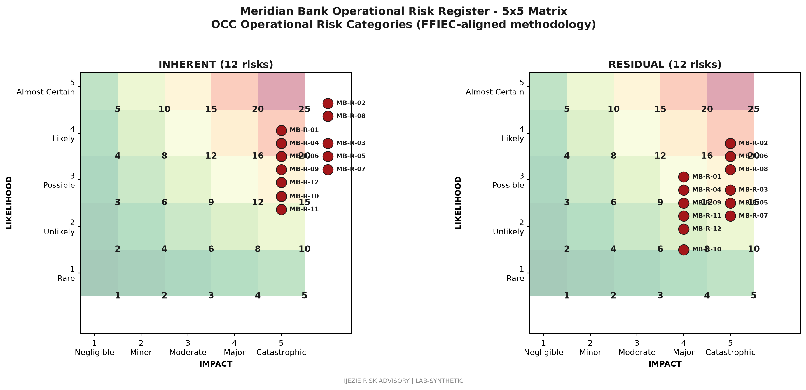

# Board and Risk Committee Quarterly Briefing

## 1. Executive Summary

Meridian Bank enters the second half of 2026 with a stable cyber risk posture and no open Matters Requiring Attention from the 2025-Q3 IT examination. The top five cyber risks are concentrated in wire fraud (MB-R-02), third-party breach at FIS (MB-R-08), ransomware at FIS (MB-R-07), vendor concentration (MB-R-06), and synthetic identity lending losses (MB-R-04). FFIEC CAT maturity is rated Intermittent across all five domains with targeted improvement areas. SOX 2025 audit was clean with no material weakness. This briefing supports Board and Risk Committee oversight under GLBA 314.4(e) and the OCC Heightened Standards.

## 2. Cyber Risk Appetite

The Board's cyber risk appetite statement, reaffirmed in March 2026, establishes the following:

- No customer financial loss from unauthorized transactions due to cyber control failure (zero tolerance)
- Zero tolerance for unencrypted customer NPI on endpoint devices or removable media
- Acceptable residual risk: High for vendor concentration; Moderate for wire fraud BEC attempts; Low for ransomware on Meridian-controlled infrastructure
- Tolerance for BCP recovery time: Tier 1 systems at stated RTO; Tier 2 within 24 hours

The appetite is operationalized through: control standards in the Information Security Program, key risk indicators in the CRO dashboard, and quarterly variance reporting in this briefing.

## 3. Top 5 Risks (Inherent and Residual)

### 3.1 MB-R-02: Wire Fraud BEC Targeting Commercial Customers

Inherent risk: 25 (High). Residual: 12 (Moderate).
Owner: BSA Officer / CISO.

Trend: Stable. Two BEC attempts in 2026 YTD versus four in 2025 same period. MB-INC-2025-001 BEC incident (October 2025, $2.3M attempt, $1.8M recovered) drove threshold reduction from $500K to $250K for first-time beneficiary callbacks.

Mitigation: Wire callback controls, dual approval for new beneficiary banks within 14 days, quarterly BEC tabletop with top 50 commercial customers, OPEN-2026-Q2-04 wire authentication hardening project.

### 3.2 MB-R-08: Third-Party Core Banking Breach at FIS Exposing Customer NPI

Inherent risk: 25 (High). Residual: 16 (High).
Owner: CISO.

Trend: Stable but elevated by external threat environment. FIS SOC 1 Type 2 (2026-02) clean. No reported FIS security incidents affecting Meridian customer NPI in 2025 or 2026 YTD.

Mitigation: Annual on-site assessment of FIS security program, contractual right-to-audit enforcement, fourth-party inventory refresh, joint DR exercise participation, MB-R-08 specific tabletop in Q3 2026.

### 3.3 MB-R-07: Ransomware on FIS-Hosted Core Banking Host

Inherent risk: 20 (High). Residual: 12 (Moderate).
Owner: CISO.

Trend: Stable. FIS operates managed detection and response with isolation capability. Shared responsibility model documented in MSA.

Mitigation: FIS ransomware tabletop scheduled for Q3 2026, immutable backup validation, recovery runbook tested in March 2026 DR cycle.

### 3.4 MB-R-06: Core Banking Vendor Concentration on FIS Profile

Inherent risk: 16 (High). Residual: 12 (Moderate).
Owner: CIO.

Trend: Stable. Concentration acknowledged and mitigated rather than eliminated.

Mitigation: Long-term FIS contract through 2029, exit playbook refreshed annually, 24-month replacement horizon in risk register, OPEN-2026-Q2-03 fourth-party concentration analysis in flight.

### 3.5 MB-R-04: Synthetic Identity Lending Losses

Inherent risk: 16 (Moderate). Residual: 9 (Moderate).
Owner: Chief Credit Officer.

Trend: Improving. 2025 synthetic identity losses down 18 percent year-over-year. Enhanced identity verification through LexisNexis and early warning indicators in credit decisioning.

Mitigation: LexisNexic risk score integration, multi-bureau verification for unsecured consumer loans, automated monitoring for early-stage delinquency patterns consistent with synthetic identities.

## 4. FFIEC CAT Maturity Status

The FFIEC Cybersecurity Assessment Tool is the primary federal cybersecurity framework. Meridian's inherent risk profile is rated High. Maturity profile is Intermittent across all five domains: Cyber Risk Management and Oversight, Threat Intelligence and Collaboration, Cybersecurity Controls, External Dependency Management, and Cyber Incident Management and Resilience.

Targeted improvement areas for 2026:

- Cyber Risk Management and Oversight: Advance to Innovative through enhanced board risk reporting automation and continuous control monitoring.
- External Dependency Management: Advance to Intermittent-plus through fourth-party concentration analysis (OPEN-2026-Q2-03).
- Cyber Incident Management and Resilience: Advance to Innovative through tabletop program cadence.

Full re-assessment is performed annually with quarterly refresh. Next annual assessment: October 2026.

## 5. MRA Status Update

The 2025-Q3 IT examination produced six MRAs, all closed during the 2026-Q1 remediation cycle (see IJZ-MER-MRA-20260627). Four forward-looking items are tracked in remediation with target close dates between September and December 2026.

## 6. GLBA Board Reporting (314.4(e))

GLBA Safeguards Rule 16 CFR 314.4(e) requires the Board to oversee the information security program. Meridian's Board Risk Committee receives quarterly briefings including: threat landscape update, control effectiveness metrics, incident summary, vendor risk concentration, and program budget. Annual approval of the Information Security Program is documented in the March Board minutes.

## 7. SOX Material Weakness Statement

The 2025 SOX audit (cycle completed February 2026) was clean with no material weakness identified in IT general controls covering FIS Profile, ACI wire processing, and Fiserv card services. The 2026 audit cycle is in progress with PCAOB auditor on-site through July 2026. No preliminary material weakness indicators as of this briefing.

## 8. Vendor Concentration

Critical vendor concentration on FIS, Fiserv, ACI, and Jack Henry accounts for approximately 60 percent of total vendor spend. This reflects the regulated core banking and payments architecture. The concentration is documented in MB-R-06 with mitigation through long-term contracts, exit planning, and joint exercises.

## 9. BCP/DR Posture

The March 2026 FIS Profile failover test achieved RTO of 3h 47m against the 4-hour target. The Q2 2026 wire transfer and FedLine joint test is scheduled for late June. The annual full-enterprise exercise is scheduled for September 2026. No open BCP findings as of this briefing (see IJZ-MER-BCP-DR-20260627).

## 10. Recommendations for Board Action

The CRO and CISO recommend Board consideration of the following:

- Approve the updated cyber risk appetite statement (no change recommended for 2026 Q3)
- Approve the FY2027 information security program budget with continued investment in continuous control monitoring
- Note the four forward-looking remediation items and their target close dates
- Affirm the FY2026 BCP/DR exercise scope including the FIS-hosted ransomware tabletop

## 11. What This Demonstrates

This briefing demonstrates that Meridian Bank operates under an active Board risk oversight program with documented cyber risk appetite, top-five risk tracking with inherent and residual ratings, FFIEC CAT maturity trajectory, MRA closure status, and SOX clean opinion. The cadence and content align to GLBA 314.4(e), OCC Heightened Standards, and FFIEC board oversight expectations.

## 12. Next Briefing

The next quarterly briefing is scheduled for 2026-09-30, covering Q3 2026 results and the annual full-enterprise DR exercise outcomes.

---

Prepared by Ijezie Risk Advisory for Meridian Bank examiner readiness engagement.