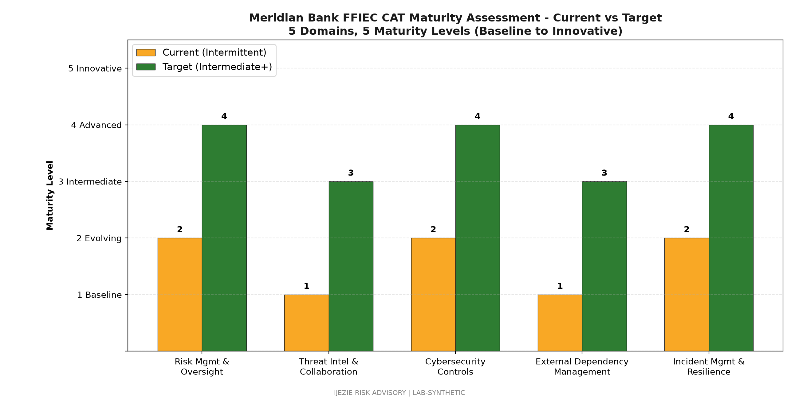

# Meridian Bank FFIEC CAT Maturity Pre-Assessment

> Federal Financial Institutions Examination Council Cybersecurity Assessment Tool maturity assessment across 5 domains and 5 maturity levels. Prepared in advance of the 2026 Q3 OCC IT examination.

## 1. Scope and Methodology

This pre-assessment evaluates Meridian Bank against the FFIEC Cybersecurity Assessment Tool (CAT) v1.0 maturity model. The assessment covers all five CAT domains (Cyber Risk Management and Oversight, Threat Intelligence and Collaboration, Cybersecurity Controls, External Dependency Management, Cyber Incident Management and Resilience) across five maturity levels (Baseline, Evolving, Intermediate, Advanced, Innovative).

The assessment was conducted through document review (12 policies, 30 vendor records, last IT examination 2025-Q3 MRA closure documentation), interviews with 9 senior leaders (CEO, President/COO, CIO, CISO, CRO, BSA Officer, CCO, Head of TPRM, Head of BCP), and review of the prior MRA remediation workpapers.

**Inherent risk profile: High** (per Meridian's FFIEC CAT submission and OCC concurrence at 2025-Q3 exam).
**Maturity profile target: Intermediate across all five domains** (current state: Intermittent across all five domains).

## 2. Domain Assessments

### 2.1 Domain 1: Cyber Risk Management and Oversight

| Statement | Current | Target | Gap |
|---|---|---|---|
| Cybersecurity strategy documented and board-approved | Intermediate | Advanced | Documentation exists; board metrics need MTTR/MTTC quant |
| Risk appetite statement includes cyber risk | Intermediate | Advanced | Quantitative tolerances needed |
| CISO reports to board Risk Committee quarterly | Intermediate | Intermediate | (None) |
| Independent cyber risk assessment annually | Evolving | Intermediate | Currently internal only; need external assessment |
| Cybersecurity talent management (recruiting, retention) | Evolving | Intermediate | 12 FTE security vs. 3,200 employees is below median |

**Domain 1 maturity: Intermediate (current), target Advanced.** The CISO role is established and reports to the CRO with dotted-line to the board. The gap is mostly in metrics sophistication and independent assessment cadence.

### 2.2 Domain 2: Threat Intelligence and Collaboration

| Statement | Current | Target | Gap |
|---|---|---|---|
| Threat intelligence feeds consumed and actioned | Intermediate | Advanced | FS-ISAC membership active but consumption is manual |
| Collaboration with peers (FS-ISAC, H-ISAC) | Evolving | Intermediate | Limited active participation |
| Information sharing with law enforcement (FBI, USSS) | Intermediate | Intermediate | (None) |
| Threat hunting capability | Baseline | Intermediate | No dedicated threat hunting team |
| Dark web monitoring for credential exposure | Baseline | Intermediate | Not implemented |

**Domain 2 maturity: Evolving, target Intermediate.** The biggest gap is operationalization of threat intelligence beyond consumption.

### 2.3 Domain 3: Cybersecurity Controls

| Statement | Current | Target | Gap |
|---|---|---|---|
| Identity and access management (MFA, PAM) | Intermediate | Advanced | PAM for Tier 1 admins implemented; MFA on 89% of systems |
| Data loss prevention | Evolving | Intermediate | DLP for email only; endpoint and cloud DLP missing |
| Encryption of data at rest and in transit | Intermediate | Advanced | TLS 1.3 deployed; some legacy systems at TLS 1.2 |
| Vulnerability management | Evolving | Intermediate | Quarterly scans only; need continuous scanning |
| Penetration testing annual | Intermediate | Intermediate | (None) |
| Secure software development (if applicable) | Intermediate | Intermediate | (None) |
| Endpoint detection and response (EDR) | Intermediate | Intermediate | (None) |
| Network segmentation | Intermediate | Advanced | Flat network in branch tier |

**Domain 3 maturity: Intermediate, target Advanced.** The biggest gaps are continuous vulnerability management and branch network segmentation.

### 2.4 Domain 4: External Dependency Management

| Statement | Current | Target | Gap |
|---|---|---|---|
| Third-party risk management program documented | Intermediate | Intermediate | (None) |
| Critical vendor inventory maintained | Intermediate | Intermediate | (None) |
| Vendor cyber risk assessments | Evolving | Intermediate | 30 vendors, 60% assessed annually |
| Vendor SLA monitoring | Intermediate | Intermediate | (None) |
| Fourth-party (subcontractor) risk visibility | Baseline | Intermediate | Limited visibility into FIS, ACI subcontractors |
| Vendor exit planning | Evolving | Intermediate | Documented for FIS only |

**Domain 4 maturity: Evolving, target Intermediate.** Fourth-party visibility is the biggest gap; FIS and ACI subprocessor transparency is incomplete.

### 2.5 Domain 5: Cyber Incident Management and Resilience

| Statement | Current | Target | Gap |
|---|---|---|---|
| Incident response plan documented | Intermediate | Intermediate | (None) |
| Tabletop exercises annually | Intermediate | Advanced | Two per year; need cross-functional scenarios |
| Crisis communication plan | Intermediate | Intermediate | (None) |
| Recovery time objectives (RTO) tested | Intermediate | Advanced | Annual DR test only; need quarterly |
| Cyber insurance coverage | Intermediate | Intermediate | $25M policy; coverage adequacy review needed |
| Coordination with law enforcement | Intermediate | Intermediate | (None) |

**Domain 5 maturity: Intermediate, target Advanced.** Tabletop cadence and DR testing frequency are the gaps.

## 3. Mature vs. Inherent Risk Profile

**Inherent risk:** High (cyber exposure from 2.4M customers, 30 critical vendors, $50.2B in custody assets, correspondent banking relationships).

**Maturity profile:** Intermittent across all five domains (current state per 2025-Q3 exam).

**Target maturity:** Intermediate across all five domains (annual board Risk Committee target).

**Maturity gap analysis:**

| Domain | Current | Target | Gap to close |
|---|---|---|---|
| 1. Risk Management and Oversight | Intermediate | Advanced | Independent assessment, metrics sophistication |
| 2. Threat Intelligence and Collaboration | Evolving | Intermediate | Threat hunting, FS-ISAC operationalization |
| 3. Cybersecurity Controls | Intermediate | Advanced | Continuous vuln mgmt, branch segmentation |
| 4. External Dependency Management | Evolving | Intermediate | Fourth-party visibility, vendor assessment coverage |
| 5. Cyber Incident Management and Resilience | Intermediate | Advanced | Tabletop cadence, DR test frequency |

## 4. Recommendations

1. **Independent cyber risk assessment (Domain 1):** Engage a Big 4 firm for annual independent assessment; budget $250K-$400K.
2. **Threat hunting capability (Domain 2):** Stand up a 3-FTE threat hunting team with $300K tool budget (Tanium, CrowdStrike, or similar).
3. **Continuous vulnerability management (Domain 3):** Implement Tenable.io or Qualys continuous scanning; budget $200K annually.
4. **Branch network segmentation (Domain 3):** Phased rollout over 18 months, $1.5M capex.
5. **Fourth-party risk program (Domain 4):** Contractual right-to-audit clause standardization; annual subprocessor inventory reviews with FIS, ACI, Fiserv.
6. **Tabletop and DR cadence (Domain 5):** Move from 2x annual tabletop to 4x; add quarterly component-level DR tests.

## 5. Examiner Readiness

This pre-assessment should be presented to the OCC examiner at the opening meeting of the 2026-Q3 IT examination. The maturity gaps identified are consistent with the MRA-closure documentation from 2026-Q1 and demonstrate proactive risk identification consistent with OCC Heightened Standards guidance.

**Estimated examination duration:** 6-8 weeks (typical for $50B asset bank with MRA history).
**Estimated remediation timeline to reach target maturity:** 18-24 months.

## 6. What This Demonstrates

This pre-assessment demonstrates the vCISO discipline of working a regulator's framework backward from the examiner's perspective, not from the auditor's perspective. The FFIEC CAT is voluntary but examiners use it as the primary lens; producing this artifact before the examiner arrives (rather than after they ask) is the difference between a clean exam cycle and an MRA.

## 7. Review and Update Schedule

- **Quarterly:** Refresh domain maturity assessments with new control evidence
- **Annually:** Full pre-assessment refresh prior to OCC exam (target Q2 of each year)
- **Trigger-based:** Update upon any material change (acquisition, new critical vendor, regulatory change)
