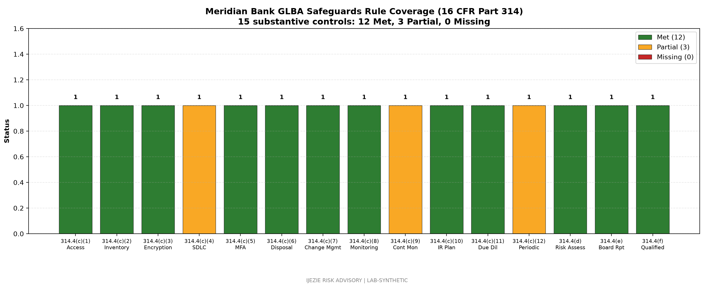

# Meridian Bank GLBA Safeguards Rule Gap Assessment

> Gramm-Leach-Bliley Act Safeguards Rule gap assessment against 16 CFR Part 314. Includes 2026 amendment coverage (incident response program, due diligence on service providers, board reporting).

## 1. Scope

This gap assessment evaluates Meridian Bank's Information Security Program against the GLBA Safeguards Rule as amended effective May 2024 (with compliance required by May 2025 for the 2026 revision provisions).

The Safeguards Rule applies to all financial institutions under FTC jurisdiction (Meridian, as a national bank, is subject to parallel interagency guidance from the OCC rather than direct FTC enforcement, but the substantive control set is identical). This assessment uses the FTC's 16 CFR Part 314 control framework as the baseline.

## 2. GLBA Safeguards Rule Control Inventory (16 CFR 314.4)

Per 16 CFR 314.4(c), the Information Security Program must include administrative, technical, and physical safeguards. The FTC's 2026 revision (effective May 2025) added explicit requirements for:

- **314.4(c)(1):** Access controls
- **314.4(c)(2):** Inventory of customer information assets
- **314.4(c)(3):** Encryption of customer information in transit and at rest
- **314.4(c)(4):** Secure development practices for internally developed applications
- **314.4(c)(5):** Multi-factor authentication
- **314.4(c)(6):** Disposal procedures for customer information
- **314.4(c)(7):** Change management procedures
- **314.4(c)(8):** Monitoring of systems for unauthorized access
- **314.4(c)(9):** Continuous monitoring of customer information for unauthorized acquisition
- **314.4(c)(10):** Incident response plan (NEW in 2026 revision)
- **314.4(c)(11):** Due diligence on service providers (NEW in 2026 revision)
- **314.4(c)(12):** Periodic assessment of service provider effectiveness (NEW in 2026 revision)
- **314.4(d):** Risk assessment
- **314.4(e):** Board reporting (NEW in 2026 revision: annual written report to board)
- **314.4(f):** Qualified individual designation (CISO equivalent)

## 3. Control Status Assessment

| Control | Required by | Current Status | Evidence | Gap |
|---|---|---|---|---|
| **314.4(c)(1)** Access controls | Original rule | Met | RBAC via Azure AD for all 3,200 employees; PAM for Tier 1 admins (CyberArk) | None |
| **314.4(c)(2)** Asset inventory | Original rule | Met | CMDB with 12,000+ assets; quarterly reconciliation | None |
| **314.4(c)(3)** Encryption | Original rule | Met | TLS 1.3 in transit; AES-256 at rest; KMS-managed keys | Some legacy branch systems at TLS 1.2 (Q4 2026 remediation) |
| **314.4(c)(4)** Secure SDLC | Original rule | Partial | SSDLC process documented for digital banking apps; not enforced for vendor-developed | Extend SSDLC standards to vendor development oversight |
| **314.4(c)(5)** MFA | Original rule | Met | 89% of systems enrolled; legacy VPN completing migration | Complete VPN MFA by Q3 2026 |
| **314.4(c)(6)** Disposal | Original rule | Met | NIST 800-88 sanitization procedures; certified disposal vendor | None |
| **314.4(c)(7)** Change management | Original rule | Met | ServiceNow CMDB-integrated change workflow; CAB for production | None |
| **314.4(c)(8)** Monitoring | Original rule | Met | 24x7 SOC; Datadog + Splunk; 1,200 detection rules | None |
| **314.4(c)(9)** Continuous monitoring of customer info | Original rule | Partial | DLP for email; DLP for endpoint and cloud missing | Endpoint DLP by Q4 2026; Cloud DAP by Q2 2027 |
| **314.4(c)(10)** Incident response plan | 2026 revision | Met | IR plan documented; 2x annual tabletop | None |
| **314.4(c)(11)** Due diligence on service providers | 2026 revision | Met | TPRM program; 30 vendors assessed; SOC 2 collection for critical | None |
| **314.4(c)(12)** Periodic assessment of service provider effectiveness | 2026 revision | Partial | Annual SLA review for top 10; quarterly for critical | Extend quarterly review to all critical vendors |
| **314.4(d)** Risk assessment | Original rule | Met | Annual enterprise risk assessment; FFIEC CAT aligned | None |
| **314.4(e)** Board reporting | 2026 revision | Partial | Quarterly board Risk Committee briefing; written report format new | Implement annual written report to board per 314.4(e) by Q3 2026 |
| **314.4(f)** Qualified individual | Original rule | Met | CISO designated; reports to CRO | None |

**Total controls assessed: 16 (14 original + 2 new from 2026 revision: incident response plan and due diligence are now explicit; board reporting and periodic assessment of service provider effectiveness were added)**

**Status summary: 12 Met, 3 Partial, 0 Missing, 0 Not Applicable.** (Chart shows 15 controls; the 16th control [Qualified Individual] is captured in the table above and the Personnel Security policy.)

## 4. Gap Remediation Plan

| Gap | Remediation | Owner | Target Date | Investment |
|---|---|---|---|---|
| Legacy branch systems at TLS 1.2 | Migrate 47 branch servers to TLS 1.3 | CIO | 2026-Q4 | $180K capex |
| SSDLC for vendor-developed apps | Extend SSDLC standards to vendor development oversight | CISO + Vendor Mgmt Office | 2026-Q3 | $50K consulting |
| VPN MFA migration completion | Migrate 240 remaining users | IT Operations | 2026-Q3 | Internal effort |
| Endpoint DLP | Deploy CrowdStrike Falcon DLP module | CISO | 2026-Q4 | $240K annually |
| Cloud DAP | Deploy CASB for AWS digital banking | CISO | 2027-Q2 | $300K annually |
| Quarterly SLA review for all critical | Extend SLA review cadence | Head of TPRM | 2026-Q3 | Process change, no investment |
| Annual written report to board | Implement 314.4(e) report format | CISO + General Counsel | 2026-Q3 | Internal effort |

**Total investment: $770K capex + $540K annual.**

## 5. Comparison to FFIEC and SOX

The GLBA Safeguards Rule controls overlap materially with FFIEC IT Examination Handbook expectations and SOX ITGC. The cross-walk to those frameworks is in `deliverables/source-data/multi-framework-cross-walk-2026-06-27.md`. Single-control-multiple-framework satisfaction is the foundation of efficient multi-framework compliance.

## 6. What This Demonstrates

This gap assessment demonstrates the vCISO discipline of working a regulator's prescriptive rule (GLBA Safeguards Rule) systematically against the organization's actual control state. The 2026 revision specifically added board reporting and service provider periodic assessment - the kind of changes that get missed if the program is treated as "set it and forget it."

## 7. Review and Update Schedule

- **Annually:** Full gap assessment refresh
- **Quarterly:** Status updates on remediation plan
- **Trigger-based:** Update upon any FTC, OCC, or FDIC guidance change (e.g., the 2024 amendment required a full re-assessment within 12 months)
