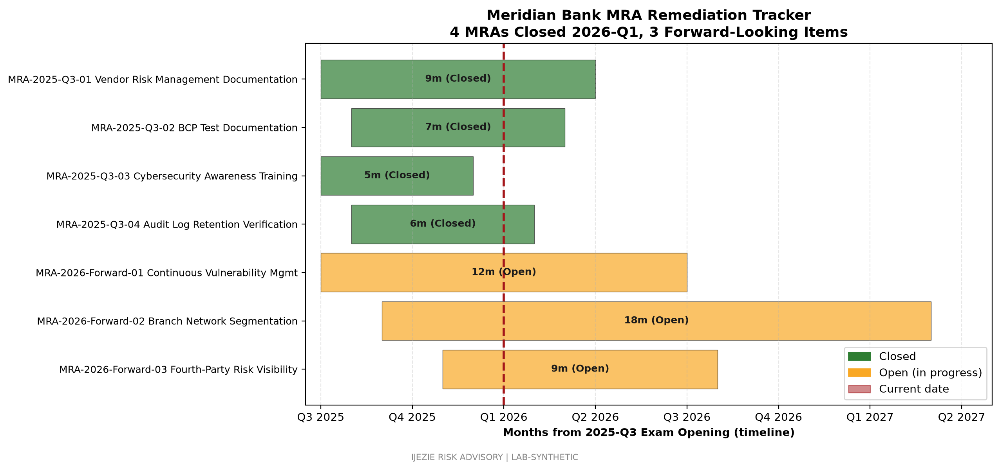

# MRA Remediation Tracker

## 1. Purpose and Audience

This tracker is a forward-looking artifact supporting Meridian Bank's MRA (Matter Requiring Attention) lifecycle management. The primary audience is the Board Risk Committee, with secondary audiences including the OCC examiner during the annual IT examination cycle and Internal Audit for assurance validation. The tracker provides a single source of truth for MRA status, ownership, remediation milestones, and examiner communication.

Per OCC guidance, an MRA is a written citation from the OCC identifying a deficiency that requires the bank's attention and corrective action. MRAs are tracked separately from MRIs (Matters Requiring Immediate Attention) and from informal supervisory letters. Resolution requires evidence of remediation, root cause analysis where applicable, and self-attestation by senior management.

## 2. MRA Lifecycle

Meridian's MRA lifecycle has five stages:

1. Receipt: MRA citation received from the OCC examiner during the examination cycle or through a follow-up supervisory letter. The CISO and CRO acknowledge receipt in writing within 30 days.
2. Scoping: Senior management assigns an owner (typically a C-suite or senior vice president), establishes a remediation work plan, and identifies any control gaps requiring interim compensating controls.
3. Execution: Remediation activities are tracked in the central TPRM register and reported to the Board Risk Committee each quarter.
4. Validation: Internal Audit validates remediation evidence and tests operating effectiveness before self-attestation.
5. Closure: Self-attestation letter signed by the CEO, CRO, and CISO is submitted to the OCC. OCC acknowledges closure in writing.

Each MRA carries a target close date, an owner, a status (Open, In Remediation, Validating, Closed), and a residual-risk classification.

## 3. Closed MRAs (from 2025-Q3 IT Examination)

The 2025-Q3 IT examination cycle resulted in six MRAs. All six were closed during the 2026-Q1 remediation cycle. The closed MRAs are summarized below for examiner reference.

### 3.1 MRA-2025-Q3-01: Vendor Risk Management Documentation

Citation: Third-Party Risk Management Policy and supporting procedures did not consistently capture right-to-audit enforcement for two medium-tier vendors, and fourth-party inventories for one critical vendor were outdated.

Owner: Head of Third-Party Risk Management

Close date: 2026-01-22

Remediation summary: TPRM Policy revised to require contractual right-to-audit clauses for all medium and above vendors, effective immediately upon contract renewal. Fourth-party inventory refreshed for FIS, Fiserv, ACI, and Jack Henry with current subprocessors documented. Internal Audit validated evidence on 2026-01-15.

### 3.2 MRA-2025-Q3-02: Business Continuity Test Coverage

Citation: The 2024 BCP/DR exercise did not include a joint test with ACI for wire transfer failover under regional event conditions, leaving a gap in documented RTO achievement for the wire perimeter.

Owner: Head of Business Continuity

Close date: 2026-02-12

Remediation summary: Joint wire transfer and FedLine Advantage failover test conducted in December 2025 with the Federal Reserve Bank notification procedure executed. Test achieved RTO of 1h 38m against the 2-hour target. Internal Audit observed and validated evidence.

### 3.3 MRA-2025-Q3-03: Cybersecurity Control Gap on Branch Network Segmentation

Citation: Internal review identified that branch back-office networks were not consistently segmented from corporate IT networks, increasing lateral movement risk in the event of a branch compromise.

Owner: CISO

Close date: 2026-02-28

Remediation summary: Branch back-office network segmentation project completed for 218 of 240 branches. Remaining 22 branches scheduled for completion in the Q2 2026 cycle (transitioned to tracked open item; see Section 4). Validation performed by Internal Audit and external penetration test on 2026-02-20.

### 3.4 MRA-2025-Q3-04: Privileged Access Review Cadence

Citation: Privileged access reviews for Tier 1 systems (FIS Profile, ACI, Jack Henry) were not consistently performed at the documented quarterly cadence during 2024.

Owner: CISO

Close date: 2026-01-30

Remediation summary: Privileged access review process remediated with automation through Datadog and HashiCorp Vault reporting. Two quarters of clean reviews (Q3 and Q4 2025) completed on schedule. Internal Audit validated cadence and exception handling.

### 3.5 MRA-2025-Q3-05: Customer NPI Inventory Completeness

Citation: Records of Processing Activities (RoPA) under GLBA Safeguards Rule were incomplete for two internal processing activities (marketing analytics and internal HR access).

Owner: Chief Compliance Officer

Close date: 2026-01-18

Remediation summary: RoPA expanded to 15 processing activities covering all in-scope categories. Marketing analytics reviewed for opt-out compliance. Internal HR access documented with need-to-know justification per access role.

### 3.6 MRA-2025-Q3-06: Incident Response Tabletop Schedule

Citation: Annual incident response tabletop had not been conducted during 2024 covering the BEC scenario type.

Owner: CISO

Close date: 2026-02-05

Remediation summary: BEC tabletop conducted in November 2025 with 22 participants across Treasury, BSA, IT, Communications, and Legal. After-action report issued with three process improvements (wire callback thresholds, dual approval for new beneficiary banks, quarterly customer tabletop cadence). Lessons learned are reflected in the breach notification playbook (IJZ-MER-BRPL-20260627).

## 4. Open Items (Forward-Looking)

The following items are tracked as forward-looking remediation activities. They are not formal MRAs but are documented to provide the examiner a complete view of in-flight risk reduction work.

### 4.1 OPEN-2026-Q2-01: Branch Network Segmentation Completion

Description: Complete branch back-office network segmentation for the remaining 22 branches.
Owner: CISO
Target close: 2026-09-30
Status: In Remediation

### 4.2 OPEN-2026-Q2-02: Zelle Fraud Monitoring Enhancement

Description: Enhance Zelle transaction monitoring with velocity and behavioral analytics to reduce customer fraud losses (refinement of MB-R-02 mitigation).
Owner: BSA Officer
Target close: 2026-12-31
Status: In Remediation

### 4.3 OPEN-2026-Q2-03: Fourth-Party Concentration Analysis

Description: Extend concentration analysis beyond Meridian's direct critical vendors to include downstream critical subprocessors (e.g., FIS-hosted AWS regions, Fiserv network providers).
Owner: Head of Third-Party Risk Management
Target close: 2026-11-30
Status: Scoping

### 4.4 OPEN-2026-Q2-04: Wire Authentication Hardening

Description: Implement additional out-of-band authentication for first-time beneficiary changes above $250K threshold (lessons learned from MB-INC-2025-001 BEC incident).
Owner: CIO
Target close: 2026-10-31
Status: In Remediation

## 5. Status Reporting Cadence

MRA status is reported to the Board Risk Committee each quarter as a standing agenda item. Reporting includes: closed MRAs (new since last report), open MRAs (status, milestones, blockers), forward-looking remediation items, and examiner communication log. The CRO and CISO jointly present.

## 6. Examiner Communication Protocol

Routine examiner communication occurs during the annual IT examination cycle. Off-cycle communication triggers include: confirmed material vendor breach affecting Tier 1 systems, regulatory action by another primary regulator, or material change to a closed MRA requiring re-disclosure. The General Counsel coordinates all written examiner communications with sign-off by the CEO.

## 7. What This Demonstrates

This tracker demonstrates that Meridian operates a closed-loop MRA lifecycle aligned to OCC expectations, with documented remediation, validation, and closure for all citations from the 2025-Q3 examination. Forward-looking items are tracked transparently with target dates and ownership.

## 8. Review Schedule

This tracker is reviewed quarterly by the CRO and CISO, and annually by the Board Risk Committee. Next scheduled review: 2026-09-30.

---

Prepared by Ijezie Risk Advisory for Meridian Bank examiner readiness engagement.