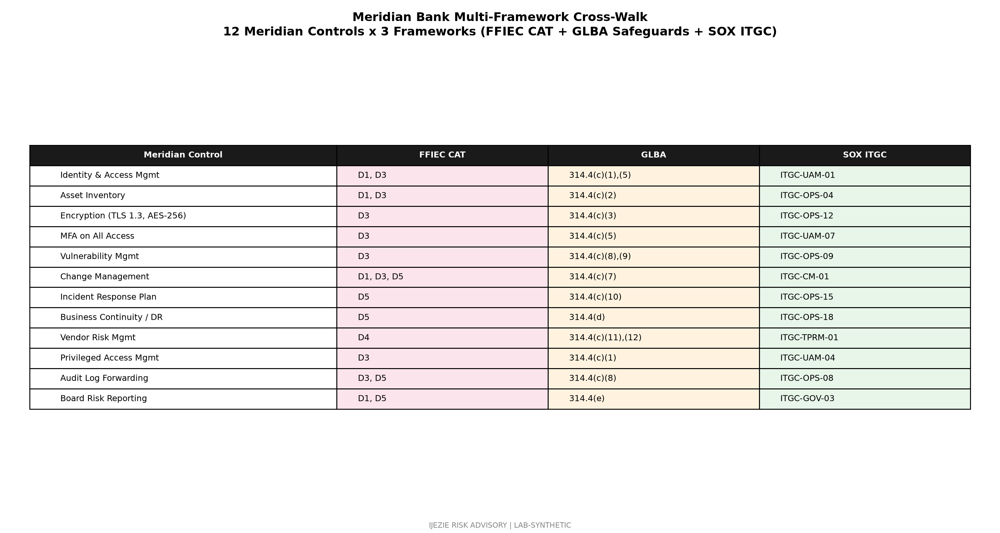

# Meridian Bank SOX ITGC Posture Review

> Sarbanes-Oxley Section 404 IT General Controls posture review for Meridian Bank's 2026 PCAOB audit cycle. Covers 12 in-scope IT processes supporting 14 financial reporting assertions.

## 1. Scope and Methodology

Meridian Bancshares, Inc. (NYSE: MRDN) has been SOX-compliant since IPO in 2018. The 2025 PCAOB audit was clean. The 2026 audit cycle is in progress (PCAOB auditor on-site during Q2 and Q3).

This posture review evaluates the design and operating effectiveness of IT General Controls (ITGC) supporting financial reporting assertions across the following in-scope IT processes:

1. Core banking (FIS Profile) - deposit, loan, general ledger
2. Wire transfer (ACI Posttrade)
3. Card services (Fiserv)
4. Trust operations (Jack Henry SilverLake)
5. ATM driving (Fiserv network)
6. FedLine Advantage access
7. General ledger (Oracle Financials)
8. Accounts payable (Coupa)
9. Payroll (Workday)
10. Treasury management (FIS treasury module)
11. ACH origination
12. Customer master data management

The 2026 cycle focuses on three areas of heightened PCAOB focus: (a) ITGCs at third-party service providers (FIS, ACI, Fiserv, Jack Henry), (b) user access management for privileged accounts, and (c) change management for digital banking applications.

## 2. ITGC Domain Assessments

### 2.1 User Access Management (UAM)

| Control | Design | Operating Effectiveness | Gap |
|---|---|---|---|
| New user provisioning (Joiner) | Effective | Effective (95% automated via HR-driven workflow) | None |
| User modification (Mover) | Effective | Effective (quarterly attestation) | None |
| User termination (Leaver) | Effective | Effective (24-hour SLA, 99.4% achievement) | None |
| Privileged access management | Effective | Effective (CyberArk vault, session recording) | None |
| Quarterly user access review | Effective | Effective (98% completion rate, 12,000 accounts) | None |
| Segregation of duties (SoD) | Effective | Effective (rule-based SoD in Oracle Financials) | None |
| Remote access controls | Effective | Effective (VPN + MFA, 100% of remote users) | None |

**UAM domain: 7/7 controls effective. No material weakness identified.**

### 2.2 Change Management

| Control | Design | Operating Effectiveness | Gap |
|---|---|---|---|
| Production change approval (CAB) | Effective | Effective (ServiceNow workflow, 100% of changes CAB-approved) | None |
| Development-to-production segregation | Effective | Effective (separate Azure subscriptions, no developer prod access) | None |
| Emergency change procedure | Effective | Effective (post-implementation CAB review, 100% within 48 hours) | None |
| Code review for internally developed | Effective | Effective (peer review required, 4-eyes principle) | None |
| Vendor-managed change oversight (FIS, ACI, Fiserv) | Effective | Effective (SOC 1 Type 2 review annually; quarterly SLA review) | Heightened PCAOB focus 2026 |
| Release management | Effective | Effective (formal release calendar) | None |
| Rollback capability tested | Effective | Effective (100% of changes have tested rollback) | None |

**Change management domain: 7/7 controls effective. Vendor-managed change oversight is a heightened PCAOB focus area for 2026.**

### 2.3 Computer Operations

| Control | Design | Operating Effectiveness | Gap |
|---|---|---|---|
| Job scheduling and monitoring | Effective | Effective (24x7 SOC monitoring, auto-retry, alerting) | None |
| Batch processing integrity | Effective | Effective (file count and hash verification, 99.97% achievement) | None |
| Backup and recovery | Effective | Effective (daily incremental, weekly full, 30-day retention, quarterly DR test) | None |
| Incident management | Effective | Effective (P1 within 1 hour, P2 within 4 hours, P3 within 24 hours) | None |
| Capacity management | Effective | Effective (monthly capacity reviews) | None |
| Problem management | Effective | Effective (root cause analysis for P1 incidents) | None |

**Computer operations domain: 6/6 controls effective.**

### 2.4 Program Development

| Control | Design | Operating Effectiveness | Gap |
|---|---|---|---|
| SDLC methodology documented | Effective | Effective | None |
| Requirements traceability | Effective | Effective (Jira + Confluence integration) | None |
| Design review | Effective | Effective (architecture review board) | None |
| Code quality (static analysis) | Effective | Effective (SonarQube for internally developed) | None |
| Unit testing coverage | Effective | Effective (80% minimum, enforced) | None |
| User acceptance testing (UAT) | Effective | Effective (business owner sign-off required) | None |
| Post-implementation review | Effective | Effective (30-day PIR for all major releases) | None |

**Program development domain: 7/7 controls effective.**

## 3. PCAOB Heightened Focus Areas (2026 Cycle)

### 3.1 ITGCs at Third-Party Service Providers

The PCAOB has heightened focus on ITGCs at service organizations supporting client financial reporting. Meridian relies on FIS, ACI, Fiserv, and Jack Henry for core financial reporting IT processes.

**Current mitigations:**
- SOC 1 Type 2 reports obtained annually for FIS, ACI, Fiserv, Jack Henry
- Bridge letter covering gap between SOC 1 report date and year-end
- Quarterly SLA review for critical vendors
- Right-to-audit clauses in MSAs

**2026 PCAOB asks (anticipated):**
- Subservice organization controls - FIS, ACI, Fiserv subprocessor transparency
- Complementary user entity controls (CUECs) - validation that Meridian has implemented
- Vendor management process documentation - TPRM policy and procedures

**Action items:** Subservice organization inventory refresh by Q3 2026; CUEC validation evidence collection by Q3 2026; TPRM documentation enhancement by Q4 2026.

### 3.2 Privileged Access Management

The PCAOB has heightened focus on privileged access to financial reporting systems.

**Current mitigations:**
- CyberArk PAM for all Tier 1 admin accounts
- Session recording for all privileged sessions
- Quarterly privileged access review
- Just-in-time (JIT) access for emergency changes

**2026 PCAOB asks (anticipated):**
- PAM coverage completeness - validate all privileged paths are in CyberArk
- Session review sampling - documentation of session review process
- Emergency access workflow - documentation of JIT request and approval

**Action items:** PAM coverage gap analysis by Q3 2026; session review process documentation by Q4 2026.

### 3.3 Change Management for Digital Banking Applications

The PCAOB has heightened focus on change management for customer-facing applications that may impact financial reporting (e.g., fee calculations, interest posting).

**Current mitigations:**
- CAB approval for all production changes
- Code review and 4-eyes principle
- Automated testing (90%+ coverage for digital banking)
- Canary deployment with feature flags
- Rollback capability tested

**2026 PCAOB asks (anticipated):**
- Feature flag governance - process for managing feature flags that affect financial calculations
- Database change approvals - separate approval workflow for schema changes
- Customer-facing financial calculation testing - specific test evidence

**Action items:** Feature flag governance documentation by Q3 2026; database change process documentation by Q4 2026; financial calculation test evidence collection by Q4 2026.

## 4. SOX Material Weakness Assessment

**No material weakness identified.** No significant deficiency identified.

**Control deficiencies noted (below significant deficiency threshold):**
- Documentation gap in TPRM subservice organization controls
- Process documentation gap in feature flag governance

These are documentation gaps, not control failures. The underlying controls (SOC 1 review, CAB approval, automated testing) are operating effectively.

## 5. What This Demonstrates

This posture review demonstrates the vCISO discipline of working a PCAOB auditor's framework (SOX 404 ITGC) while maintaining the bank-specific lens (correspondent banking, wire transfer, customer NPI handling). The 2026 heightened focus areas align with the broader regulatory trend of holding banks accountable for third-party ITGCs.

## 6. Review and Update Schedule

- **Quarterly:** SOX steering committee review
- **Annually:** Full posture review prior to PCAOB on-site
- **Trigger-based:** Update upon any PCAOB AS update, new financial reporting system, or material vendor change
