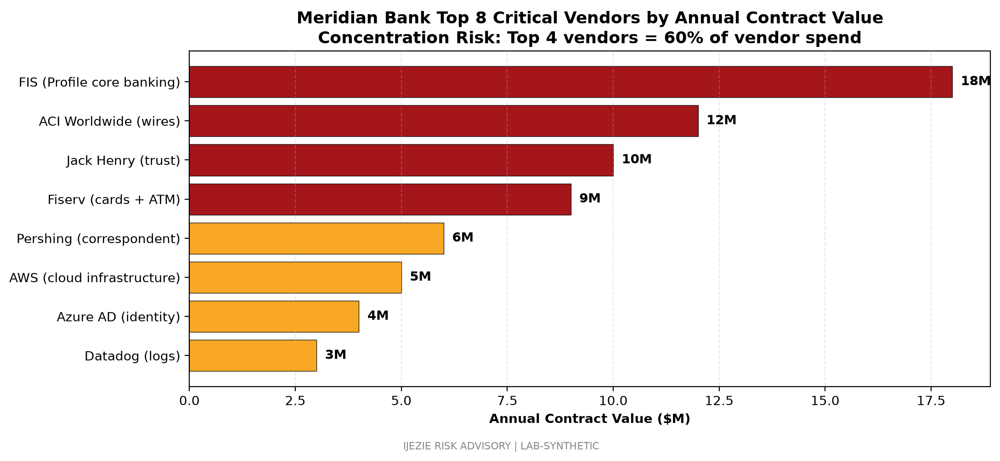

# Third-Party Risk Management and MSA Inventory

## 1. Scope

This inventory covers all third-party vendors supporting Meridian Bank's four operational perimeters: FIS Profile core banking, wire transfer and correspondent banking, wealth management and trust operations, and digital banking channels. The inventory includes 30 active vendors segmented by inherent risk tier.

## 2. TPRM Program Overview

Meridian operates a risk-based Third-Party Risk Management (TPRM) program aligned to OCC Bulletin 2013-29 and the FFIEC Outsourcing Technology Services Booklet. The program is governed by the Third-Party Risk Management Policy, the Vendor Management and Due Diligence Policy, and the Records Retention Policy. The Head of Third-Party Risk Management reports to the CRO with a dotted line to the CIO for technology vendor matters.

Inherent risk is determined by data sensitivity, regulatory dependency, customer impact, and replacement difficulty. Critical vendors are those whose disruption would impair a Tier 1 system or trigger regulatory notification. High vendors hold customer non-public information (NPI) but with substitutable alternatives. Medium vendors support internal operations without direct customer NPI access. Low vendors are commodity services.

Due diligence steps for each tier:

- Critical: SOC 1 Type 2 review, on-site assessment every two years, contractual right-to-audit, fourth-party inventory, joint DR exercise, annual executive review
- High: SOC 2 Type 2 review or equivalent, questionnaire-based assessment, contractual right-to-audit, fourth-party inventory, annual review
- Medium: SOC 2 Type 2 or equivalent, questionnaire-based assessment, biennial review
- Low: Annual attestation review

## 3. Vendor Inventory by Tier

### 3.1 Critical Vendors (9)

| # | Vendor | Service | Reg Dependency | MSA Date | SOC Report | Last Assessment | Next Review |
|---|---|---|---|---|---|---|---|
| 1 | FIS | Core banking (Profile), deposit and loan servicing | OCC-supervised service provider | 2017-04-01 (renewed 2024) | SOC 1 Type 2 annual | 2026-02 | 2027-02 |
| 2 | Jack Henry & Associates | Trust operations (SilverLake), fiduciary records | FFIEC-supervised service provider | 2018-09-15 (renewed 2025) | SOC 1 Type 2 annual | 2025-11 | 2026-11 |
| 3 | Fiserv | Card services issuer processor, ATM driving | PCI DSS 4.0 ROC annual | 2019-06-01 (renewed 2024) | PCI ROC + SOC 2 Type 2 | 2025-12 | 2026-12 |
| 4 | ACI Worldwide | Wire transfer (Posttrade), AML transaction monitoring | SOX ITGC in-scope | 2020-01-10 | SOC 1 Type 2 annual | 2026-03 | 2027-03 |
| 5 | Federal Reserve FedLine | Fedwire and FedACH access | Federal Reserve Operating Circular 5 | 2017-01-01 (no BAA-equivalent) | Federal Reserve attestation | 2026-01 | 2027-01 |
| 6 | Pershing (BNY Mellon) | Correspondent clearing, custody, trade execution | SEC/FINRA supervised introducing broker-dealer | 2018-04-20 (renewed 2025) | SOC 1 Type 2 annual | 2025-10 | 2026-10 |
| 7 | Early Warning | Zelle P2P network operator | FFIEC retail payments guidance | 2020-07-15 | SOC 2 Type 2 annual | 2026-02 | 2027-02 |
| 8 | Diebold Nixdorf | ATM hardware, encrypted PIN pad fleet | FFIEC ATM guidance | 2019-03-01 (renewed 2025) | SOC 2 Type 2 annual | 2025-09 | 2026-09 |
| 9 | LexisNexis Risk Solutions | Identity verification, fraud detection, OFAC screening | GLBA, BSA/AML, OFAC compliance | 2021-02-10 | SOC 2 Type 2 annual | 2026-01 | 2027-01 |

### 3.2 High Vendors (11)

| # | Vendor | Service | Reg Dependency | MSA Date | SOC Report | Last Assessment | Next Review |
|---|---|---|---|---|---|---|---|
| 10 | Amazon Web Services | Hosting for digital banking, fraud analytics | FFIEC Outsourced Cloud Computing | 2019-08-01 | SOC 2 Type 2 + ISO 27001/27017/27018 | 2026-02 | 2027-02 |
| 11 | Microsoft Azure AD | Employee and customer identity | OCC authentication guidance | 2020-05-15 | SOC 2 Type 2 + ISO 27001 | 2026-03 | 2027-03 |
| 12 | Datadog | APM, log aggregation, SIEM-adjacent | FFIEC audit logging expectations | 2021-09-01 | SOC 2 Type 2 annual | 2026-04 | 2027-04 |
| 13 | Splunk Cloud | Secondary SIEM archival (7-year retention) | FFIEC IT Examination Handbook retention | 2022-01-15 | SOC 2 Type 2 annual | 2026-03 | 2027-03 |
| 14 | CrowdStrike | Endpoint detection and response | FFIEC management book guidance | 2021-04-01 | SOC 2 Type 2 annual | 2026-02 | 2027-02 |
| 15 | Okta | Workforce SSO and adaptive MFA | OCC authentication guidance | 2020-11-01 | SOC 2 Type 2 annual | 2026-01 | 2027-01 |
| 16 | HashiCorp Vault | Secrets management, dynamic credentials | FFIEC privileged access guidance | 2022-06-15 | SOC 2 Type 2 annual | 2026-05 | 2027-05 |
| 17 | Snowflake | Data warehouse, BSA analytics workloads | FFIEC audit and BSA reporting | 2023-02-01 | SOC 2 Type 2 annual | 2026-04 | 2027-04 |
| 18 | DocuSign | Customer-facing electronic signatures | GLBA, state e-signature law | 2021-07-01 | SOC 2 Type 2 annual | 2025-12 | 2026-12 |
| 19 | ServiceNow | IT service management, vendor ticket workflow | Internal operations | 2020-03-15 | SOC 2 Type 2 annual | 2026-02 | 2027-02 |
| 20 | BlackLine | Financial close, SOX controls automation | SOX ITGC | 2022-09-01 | SOC 2 Type 2 annual | 2026-03 | 2027-03 |

### 3.3 Medium Vendors (7)

| # | Vendor | Service | MSA Date | SOC Report | Last Assessment | Next Review |
|---|---|---|---|---|---|---|
| 21 | Vanta | Compliance evidence automation (FFIEC CAT, SOX) | 2023-04-01 | SOC 2 Type 2 | 2026-02 | 2027-02 |
| 22 | GitHub Enterprise | Source code management, code review | 2021-11-01 | SOC 2 Type 2 | 2026-03 | 2027-03 |
| 23 | Atlassian Jira | Issue tracking, agile delivery | 2020-08-01 | SOC 2 Type 2 | 2025-12 | 2026-12 |
| 24 | Slack | Internal collaboration, incident war room | 2021-05-01 | SOC 2 Type 2 | 2026-01 | 2027-01 |
| 25 | Zoom | Video conferencing, board reporting | 2020-04-01 | SOC 2 Type 2 | 2026-01 | 2027-01 |
| 26 | Twilio | SMS OTP for customer authentication | 2022-02-15 | SOC 2 Type 2 | 2026-02 | 2027-02 |
| 27 | SendGrid | Transactional email, customer alerts | 2021-10-01 | SOC 2 Type 2 | 2025-12 | 2026-12 |

### 3.4 Low Vendors (2)

| # | Vendor | Service | MSA Date | Last Review |
|---|---|---|---|---|
| 28 | Iron Mountain | Offsite records storage (paper tapes, backup media) | 2018-06-01 | 2025-09 |
| 29 | Shred-it | Secure document destruction | 2019-01-01 | 2025-09 |

| # | Vendor | Service | Notes |
|---|---|---|---|
| 30 | Office of the Comptroller of the Currency (OCC) | Primary federal regulator | Supervisory relationship, not a commercial vendor. Tracked for completeness of regulatory inventory |

## 4. Fourth-Party (Subprocessor) Risk

Critical vendors are contractually required to disclose fourth-party subprocessors that handle Meridian customer NPI. FIS discloses AWS, Azure, and Iron Mountain as infrastructure subprocessors. Fiserv discloses Datacom and a global payments network provider. ACI discloses AWS for hosted Posttrade. Jack Henry discloses Microsoft Azure and internal data centers.

Fourth-party inventory is reviewed annually and on material change. Material subprocessors are added to the TPRM register and assigned a tier equivalent to the parent relationship.

## 5. Critical Vendor Concentration Analysis

Four vendors (FIS, Fiserv, ACI, Jack Henry) account for an estimated 60 percent of total vendor spend across the bank. This concentration reflects the regulated core banking and payments architecture: there is no commercially viable alternative to FIS Profile in Meridian's timeframe, and Fiserv holds a dominant position in card issuer processing. The concentration is documented in the CRO risk register (MB-R-06) and is a standing topic in Board Risk Committee quarterly briefings.

Mitigation: long-term contracts with renewal visibility, contractual SLA enforcement, joint DR exercise participation, and a documented exit playbook for each critical vendor.

## 6. Vendor Exit Planning

Exit playbooks are maintained for each critical vendor and refreshed annually. Playbooks document: data return formats, transition timeline (12 to 24 months), replacement vendor shortlist, regulator notification triggers, customer communication requirements, and parallel-run testing scope. The MB-R-06 risk scenario assumes a 24-month FIS replacement horizon and includes a contractual termination-for-convenience clause with 180-day notice.

## 7. What This Demonstrates

This inventory demonstrates that Meridian operates a tier-based TPRM program aligned to OCC and FFIEC expectations, with full vendor enumeration by criticality, current SOC report status, and forward-looking review schedule. Vendor concentration is acknowledged, mitigated, and reported to the Board.

## 8. Review Schedule

This inventory is reviewed quarterly by the Head of Third-Party Risk Management and annually by the Board Risk Committee. Material changes (new critical vendor, SOC report exception, fourth-party subprocessor change) trigger immediate re-review. Next scheduled review: 2026-09-30.

---

Prepared by Ijezie Risk Advisory for Meridian Bank examiner readiness engagement.